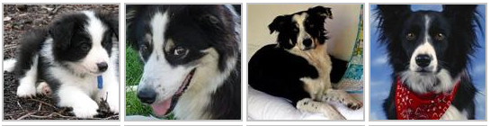
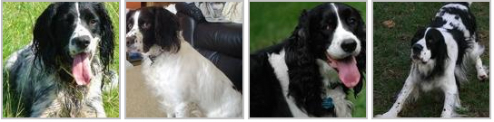
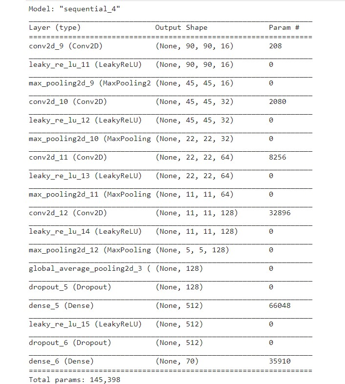
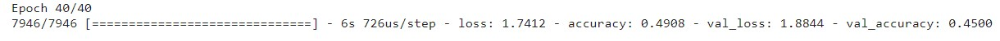
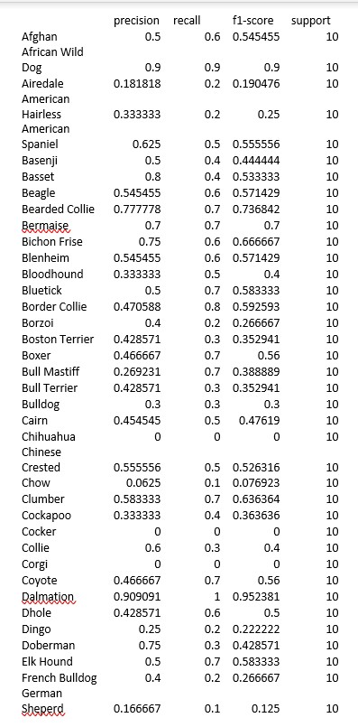
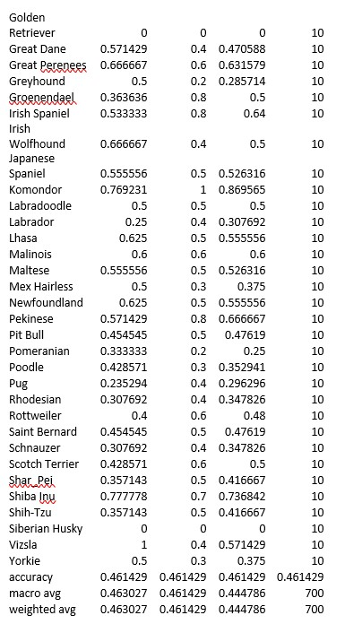

- [Proposal Report](https://unkemptArc99.github.io/cs7641-project/proposal-report)
- [Midterm Report](https://unkemptArc99.github.io/cs7641-project/midterm-report)
## Introduction and Background

Our project revolves around identifying the breeds of dogs in images. We selected a dataset that contains images of multiple dog breeds, along with their corresponding breed and if they were originally used as training data, testing data, or validation data. To classify dog breeds, we used multiple methods: firstly, simply classifying dog breeds with an input image using a convolutional neural network; secondly, using clustering algorithms to sort dogs based on extracted image features. Using a convolutional neural network had already been done well many times provided there is sufficient training data, but a main goal of ours was to create a unique algorithm in the latter part that is comparable to the supervised learning algorithm. To achieve this, we wound up actually using a neural network to obtain relevant features from the images. After this, we considered using PCA to decrease the number of features used, but given the correlation results, we went against it. Finally, we ran KMeans as our unsupervised learning algorithm to sort the dog breed images.
## Problem Definition

The purpose of this project is to investigate the effectiveness of methods we are learning in class with classifying dog breeds. In particular, we wish to compare standard supervised learning methods in their accuracy and efficiency to our own methods utilizing unsupervised learning algorithms, which rely on feature creation using the input images.

## Datasets
### Data Exploration
To approach the problem, we used public datasets provided by Kaggle, Stanford, and Tsinghua. Each dataset consists of dog image files for a certain number of breeds of dogs.

||Kaggle|Stanford|Tsinghua|
|---|---|---|---|
|Number of dog pictures|9346|20580|70428|
|Number of breeds|70|120|130|

1. [70 Dog Breeds Image dataset from Kaggle](https://www.kaggle.com/gpiosenka/70-dog-breedsimage-data-set)
2. [Stanford Dogs Dataset](http://vision.stanford.edu/aditya86/ImageNetDogs/)
3. [Tsinghua Dogs Dataset](https://cg.cs.tsinghua.edu.cn/ThuDogs/)

The below figure shows a sample type of dog breed.

_Variation in Stanford Dogs dataset. Border collie and English springer_

### Data Cleaning
Since we found datasets that have text labels with different spaces and capitalizations, we needed to clean texts and make the labels uniform. We needed to get rid of the spaces and capital letters involved. To do so, we converted the text labels into an excel spreadsheet and preprocessed the labels. 

## Supervised Learning Models

### Model 1

For Method 1 we decided to implement a convolutional neural network for the Kaggle dataset. The CNN we created has 4 different types of layers: Convolutional Layer: This layer consists of a number of filters which pick up different types of features. Each filter steps through the whole image and learns a feature such as shape of a dog’s ear. Pooling Layer: It is used to take large arrays and shrink them down. Max pooling takes the max value of pixels over a region and average pooling takes the average value. Dense or Flatten Layer: This layer converts the input array into a 1-dimensional array, where each value is a probability of the image belonging to a certain class. Activation functions are used to either activate or deactivate a weight in the CNN. The most popular one for CNNs is ReLU or some variation of it. Dropouts were used to decrease overfitting and help remove dead weights during training.

#### Model 1 Data Preprocessing

To preprocess our data, we used OpenCV. Once we figured out that the optimal number of layers was four, we resized the images to different dimensions to see which would give the best results. Through experimentation we realized that the best interpolation to use was INTER_LINEAR. We found that scaling down the images by a factor of 0.4 increased our accuracy to ~47% before starting to over-fit. We also needed to perform one hot encoding before feeding the data into the supervised learning model. Since completing the midterm report, we also applied data augmentations in the form of rotations to our dataset. This significantly improved our results.

Here is a summary of our model from the midterm: 

#### Tweaking the model and hyperparameters

The initial image dimensions were 224x224x3. With these images, we first constructed a 2 layer model which gave us an accuracy of ~11% before starting to overfit. When 3 layers were added, the accuracy was around ~13%. With 4 layers we were able to raise the accuracy to 20% before seeing overfitting. With 5 layers there was overfitting when accuracy reached 17%. Through experimentation, we found that sizing the images down to 90x90x3 with INTER_LINEAR interpolation gave us the best results. We also applied data augmentations in the form of rotations to improve the performance of the model. We also increased the number of convolutional filters. Between the midterm and now, the accuracy of the model increased from 45% to 60%! This was significant because the dataset only had 80 to 190 images per dog breed. We understood that accuracy is not the most useful metric to evaluate the model, so we only used it for some preliminary testing to figure out optimal number of layers and dimensions of images that would give best results. The final model’s performance against test data was evaluated using the metrics precision, recall, and f1 score. 

Here is the result of training of the model from the midterm report:

The metrics used to evaluate the model are:

Accuracy = TP+TN/TP+FP+FN+TN

Precision = TP/TP+FP

Recall = TP/TP+FN

F1 Score = 2*(Recall * Precision) / (Recall + Precision)

Where TP = True positives, FP = false positives, FN = false negatives, TN = true negatives. These metrics for our model from the midterm are shown below.

The next step will be to evaluate which transfer learning will be best for our application.
## Unsupervised Learning Models
When we proposed the idea in our proposal report, we had a very small and noble goal of clustering images and comparing performance against supervised classification. But as we went along with our idea, the goal became harder and harder because of the enormity of the data involved in the clustering. We started with brief experiments of using the whole image as the input data for clustering algorithms (which did not turn out to be a good idea for obvious reasons) and then tried to use traditional feature extraction algorithms from Computer Vision (which did not have good performance metrics). However, at last we are confident that we have come up with something comparable to supervised classification models.

**Motivation -** It is very important to first understand the motivation behind such an exercise. Why is there a need to cluster images, when does classification work well? We must understand that every problem about images is not just classifying images into particular categories. Sometimes, you might just want to group similar images together in order to form a rudimentary grouping for your problem. Hence, image clustering is also an essential technique in data processing. There are traditional Computer Vision algorithms, which will provide you key descriptors and matches between images (like SIFT, SURF, BRIEF, etc.). But when the data is large, these algorithms are not as fast or memory-efficient (as one might infer from our experiments in the midterm report). Hence, a new approach is required, and here is our exercise in finding one.

### Feature Extraction
Images are the **worst** dataset elements to deal with. There's too much information: 3 color channels, information about each pixel, etc. There's too much inconsistency - different sizes, different resolutions, etc. And finally, a ton of memory is required when processing images. The worst news is that there aren't many batch processing unsupervised algorithms, as unsupervised algorithms are designed to extract information out of the data that is presented. Batch algorithms are necessarily not that great at doing that. So, we need something that can compress/convert/summarize the image into a compact, informative vector.

It is almost paradoxical that we would be comparing our results against a supervised model, and our inspiration to get features out of an image is based on a supervised algorithm. So, here goes - imagine instead of using Convolutional Neural Networks (CNNs) to classify images, we use them to give us a bunch of features! We remembered how Prof. Mahdi told off-handedly in the class on how we could simply modify the last layer of any Neural Network, converting the output to the needs of the problem. This idea struck us, and hence, instead of using a sigmoid activation function in the last layer for classification, we replaced it with an identity function to provide me the features (or neuron outputs) that form the basis of the classification decision. The selection of these neuron outputs is essential as they make up a huge chunk of the decision of classification. These features will definitely be able to form a basis for the similarity analysis that goes into unsupervised clustering algorithms.

We chose ResNet models to be our base for the feature extraction. We have trialed three different ResNet models - ResNet18, ResNet34, ResNet50. We first chose a pre-trained model of all the above three models (which is readily available from the PyTorch library). Then we went on to train our set of images on the model to update the parameters. We chose a train-validate-test split of 70%,10%,20% out of the whole Tsinghua Dog Dataset. The train and validation datasets were used to train the ResNet models. The test dataset was used for clustering algorithms, which we will discuss in a future section. The trained models were then modified to serve as feature extraction models, by modifying the last layer of each model to an identity layer. The resulting models are available [here](https://gtvault-my.sharepoint.com/:f:/g/personal/asharma756_gatech_edu/ErVYpyAQsPhCiIGdQe6BQdwBxVrM8eJm0PFNkeSW7b751Q?e=B5CGoC) for use.

Each of our ResNet models gave us 512 features for each image. We first started thinking about whether we could reduce a few features from the given set. Principal Component Analysis (PCA) is the first algorithm that came to our mind. PCA tends to work better where variance between features are maximised. To determine whether we could do that, we plotted a correlation matrix between all our 512 features. Here is the result that we got for our models -





Please feel free to open the images in a new tab, or go directly to the Github repository. The images are high-resolution, but can't be displayed well on the Github pages.

As you might observe, there is not much correlation between the features. Reducing features may lose information. Hence, we chose the decision to move forward with the untouched features.

Finally, here is my final ResNet models.

[ResNet18-based Model Summary](https://unkemptArc99.github.io/cs7641-project/resnet18model)

[ResNet34-based Model Summary](https://unkemptArc99.github.io/cs7641-project/resnet34model)

[ResNet50-based Model Summary](https://unkemptArc99.github.io/cs7641-project/resnet50model)
### Applying clustering on the extracted features

Now that we finally have our images summarized into a tabular format, we can now proceed with applying unsupervised clustering on the immages in order to get our results. So, the first question when we are starting here is what algoirthms to use, and what performance metrics are we looking at. Now, we have learned a few unsupervised algorithms in the class, and we chose to go with KMeans and Gaussian Mixture Models (GMM). The reason of the choice is simple - we want to compare it against the supervised learning models, where we are aware about the number of clusters that we require. The main problem of KMeans and GMM is that we are not exactly aware of how many clusters are required for grouping. But from our dataset, we know what is the amount of clusters that we need, hence, these 2 algorithms makes proper sense.

For the performance metrics, we have gone with external measures like Mutual Info Score, Completeness Score, Rand Index, and Fowlkes Mallow Score. This is because, again, we can leverage our data to define the performance metrics base. We have not chosen to measure internal measures, as this will not make any sense while comparing the same to our supervised model.

### KMeans on ResNet models & Results
So, I performed KMeans on the features extracted from my ResNet models multiple times (~10-15 times), till I got the maximum accuracy. As you might know, depending on different initialization, you will get different results with KMeans. Here is the performance -



To be honest, this just showed the performance metrics of the base models. As the number of ResNet layers increase from 18 to 50, the scores also increase. 

### GMM on ResNet models & Results
Applying GMM on the extracted features also result in similar performance metrics. Here is the performance -


## Results and Discussion

## Final Presentation Video



## References
[1] K. Lai, X. Tu and S. Yanushkevich, "Dog Identification using Soft Biometrics and Neural Networks," 2019 International Joint Conference on Neural Networks (IJCNN), 2019, pp. 1-8, doi: 10.1109/IJCNN.2019.8851971.

[2] W. Gansbeke, S. Vandenhende, S. Georgoulis, M. Proesmans, and L. Gool, "Scan: Learning to classify images without labels," ECCV, 2020, [Paper link](https://arxiv.org/pdf/2005.12320v2.pdf)

[3] N. Manohar, Y. H. Sharath Kumar and G. H. Kumar, "Supervised and unsupervised learning in animal classification," 2016 International Conference on Advances in Computing, Communications and Informatics (ICACCI), 2016, pp. 156-161, doi: 10.1109/ICACCI.2016.7732040.

[4] Hsu, Alexander. “Unsupervised Learning for Investigating Animal Behaviors?” Medium, Medium, 15 Apr. 2020, https://medium.com/@ahsu2/unsupervised-learning-for-investigating-animal-behaviors-90ab645e8098. 

[5] Huang, Jiabo, Qi Dong, Shaogang Gong, and Xiatian Zhu. "Unsupervised deep learning by neighbourhood discovery." In International Conference on Machine Learning, pp. 2849-2858. PMLR, 2019., [Paper link](https://arxiv.org/abs/1904.11567)
