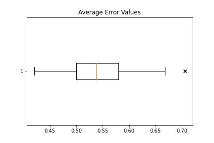
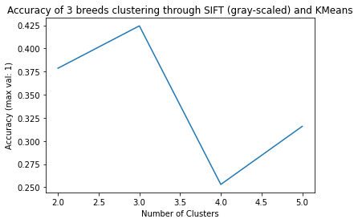

## Overview
### Introduction and Background
Our project revolves around identifying the breeds of dogs in images. There will be two aspects to the project: classifying dog breeds with an input image using a neural network, and using unsupervised learning algorithms to cluster dogs based on image features. The former project already can be done well provided there is sufficient training data, but a main goal of ours is to create a unique algorithm in the latter part that is comparable to the supervised learning algorithm. Our dataset contains images of multiple dog breeds, along with their corresponding breed and if they were originally used as training data, testing data, or validation data.
### Problem Definition
The purpose of this project is to investigate the effectiveness of methods we are learning in class with classifying dog breeds. In particular, we wish to compare standard supervised methods in their accuracy and efficiency to unsupervised methods relying on feature creation using the input images.

## Data Exploration and Cleaning

## Supervised Learning Models
Methods 
describe cnns and do calculations for number of parameters

Results and Discussion 

All groups should have their dataset cleaned at this point (justification for why we didnt need cleaning)

We expect to see data pre-processing in your project such as feature selection (Forward or backward feature selection, dimensionality reduction methods such as PCA, Lasso, LDA, .. ), taking care of missing features in your dataset, ... (data augmentation to prevent overfitting, balance dataset to get even results across breeds)

We expect to see at least one supervised or unsupervised method implemented and the results need to be studied in details. For example evaluating your predictive model performance using different metrics (take a look at ML Metrics) 

## Unsupervised Learning Models
### Dealing with the data
For an unsupervised model, we need to somehow "standardize" the data. "Standardize" here refers to transforming all the images in a standard format, where all the images are of the same size so that we can compare each image with each other. The problem with many image dataset (even here with Tsinghua dataset and Stanford dataset of dog images) is that images are not of a standard size. In order to convert them into a standardized size, we will need to perform a `reshape` operation on each of the images. The operation in itself is very easy, BUT we must remember throughout our experiment that due to this operation, we will lose some of the knowledge that we can obtain from the original image - for example, if we are doing this reshape operation on an image that is of a larger size and is not of the aspect ratio of the target size, we will lose a lot of knowledge about the shape of the features of dog from the image, as the image may be distorted. Hence, when we compare our results, we must keep these transformations and the reduction in the data from our datset in our mind.

### Model 1 - The Naive Way (KMeans on unfiltered data)
The simple way to apply an unsupervised learning algorithm on a dataset is to simply perform a "KMeans on the reshaped images using sum-squared errors as the loss function". As simple as it sounded in our heads at the start, when we started on this model, we came across a lot of issues why this is the wrong way.
#### Finding if this model is feasible
In order to first analyze whether just calculating a simple sum-squared error will work or not, we tried finding the errors between images of the same breed, and then images of the different breed, and seeing whether these errors have a certain pattern. The motivation behind this exercise was to see if there are certain thresholds OR some patterns with the sum-squared loss that we can utilize in order to concretely perform KMeans on dog images between different breeds.

So, we started by calculating the errors within images of the same breed, and seeing what errors do they throw. The method was slow, but there was no other way. Here is the algorithm that we used -
1. Get all the reshaped images (224x224x3) of the same breed into a one big Numpy array.
2. Perform a `O(N^2)` for-loop for finding errors between each images.
3. Plot a boxplot of these errors in order to visualize them.

The results of these boxplots of the 120 breeds in the Stanford dataset can be seen here - https://drive.google.com/drive/folders/1eDCdK_ckpxzjd9K4ZXuoDaNJ2Rzcztu8?usp=sharing. The average error of all the breeds can be seen in this image (values are normalized to a scale of 0-1) -

But before we could move onto capturing patterns from this data OR calculating errors between images of different breeds, we ran into some of the problems, which we explain in the next sub-section.
#### Problems
- The above algorithm gave us our first big problem - Memory Overflow. Instead of the for-loop in the 2nd step of the algorithm, we tried a faster way by using Numpy broadcasting. But the data was so huge for our code, the broadcasted array could not fit into memory. Hence, we had to utilize a for-loop instead of broadcasting.
- Because of using a for-loop, this step became excruciatingly slow. To calculate intra-breed errors of 130 breeds, the algorithm deployed on a Google Colab instance took 4.5 hours to complete. With this, we realized that performing such an analysis for inter-breed error calculation will be very time consuming.

With the above 2 problems, it was clear that there is a desperate need of feature engineering OR feature reduction that will need to be performed on the datset before we can continue on our journey to image clustering goal.

### Model 2 - Maybe CV can save us? (KMeans using SIFT descriptors)

Since there was a need of feature reduction, we turned to the idea of detecting features in image. Subsequently, Computer Vision algorithms came to our mind. There are multiple image feature descriptors (as has been outlined in this great OpenCV documentation - https://docs.opencv.org/4.x/db/d27/tutorial_py_table_of_contents_feature2d.html). Choosing the correct one becomes an important descision. Knowing not much about Computer Vision, we were struck by the SIFT (Scale-Invariant Feature Transform) descriptors. As you may recall from our initial warning about the dataset, we need to reshape OR rescale our dataset images to a standard scaling in order to compare images and their features for unsupervised learning algorithms. Having SIFT saves our assumption of caring about, how scale changes the accuracy of the dataset. Hence, SIFT immediately became a strong choice for the model.

#### SIFT (Scale-Invariant Feature Transform)
We will not go into immense details on how SIFT works and how it detects each features (frankly, we ourselves are not an expert at CV, but were a bit mesmerized by how the math works behind it). But we still want to give the reader a brief description of what SIFT needs as an input and what it gives us as an output. The reader can treat the SIFT algorithm as a blackbox, as long as he/she understands what is gained from applying such an algorithm.

In essence, the SIFT algorithm takes in an image and gives us a list of key descriptors (could be corners in the image, straight lines, normal patterns, etc.) for the image. It calculates these descriptors in a 4-step process (https://docs.opencv.org/4.x/da/df5/tutorial_py_sift_intro.html) and then these descriptors can be used to match another image using a feature matching algorithm (can be as basic as applying sum-squared function).

Our goal is to take these descriptors and use it as a feature set for our KMeans algorithm

#### The Warmup
To test our theory of whether SIFT image descriptors could help us with our image clustering, we took a sample dataset of three breeds out of the Stanford Dog Dataset and applied our model to the images classified in these 3 breeds. Since we were facing a lot of performance issues and memory issuess in our first model, this time we chose to run our model on GPUs, which also meant a steep learning curve on PyTorch.

In the end, having had some inkling of how to interact with PyTorch tensors, we finally built a small warm-up model. Our model performs the following -
1. Uses the PyTorch Dataloader functionality to lazy-load the image dataset into batches of 32 images.
2. Then applies the SIFT Feature Descriptor algorithm on them to extract features from them.
3. Compiles these Feature Descriptor into a one big tensor.
4. This big tensor is then put through the Scikit's KMeans algorithm implementation as Numpy arrays.

Using these three breeds as our initial dataset, here is what we came up with -

As you can see the accuracy is not really great. Although the positive point is that it is able to get the highest accuracy in the right number of clusters. This is definitely a positive sign. So, we started adapting our model to perform this matching on the whole Stanford dogs dataset.

#### But, Problems again...
While trying to apply this model on the whole Stanford Dogs Dataset, we again ran into issues where the combined tensor of the feature descriptors could not be loaded into the memory. This has been a great road-block for us, and now we are thinking of other ways to tackle this problem.

### What's Next? - Techniques and Models 

One big problem that we have been dealing with is the memory issue. Our next steps to tackle this problem are as follows -
1. Investigate if we can save tensors to disk storage and then load them for unsupervised learning algorithms.
2. Investigate into creating or finding an unsupervised learning algorithm which can work on batch dataset. This will help us segment the whole datset into batches and then apply the algorithm on these batches.

Also, after learning about Neural Networks (NN) and Convolutional Neural Networks (CNN) in the class, we have come up with an idea of 2 other models -
1. Using NN as our unsupervised learning algorithm, where we change the activation function to a regression function in the last layer which gives us a vector of the result of passing an image through the NN.
2. Using CNN (or just the convolutional part) for feature reduction on images, and then using the same with normal unsupervised learning algorithms.

## References
1. https://datascience.stackexchange.com/questions/48642/how-to-measure-the-similarity-between-two-images
2. http://slazebni.cs.illinois.edu/spring17/lec09_similarity.pdf
3. https://towardsdatascience.com/image-clustering-implementation-with-pytorch-587af1d14123
4. https://riptutorial.com/scipy/example/20970/image-manipulation-using-scipy--basic-image-resize-
5. https://docs.opencv.org/4.x/dc/dc3/tutorial_py_matcher.html
6. https://docs.opencv.org/4.x/da/df5/tutorial_py_sift_intro.html
7. https://docs.opencv.org/4.x/db/d27/tutorial_py_table_of_contents_feature2d.html
8. https://medium.com/data-breach/introduction-to-feature-detection-and-matching-65e27179885d