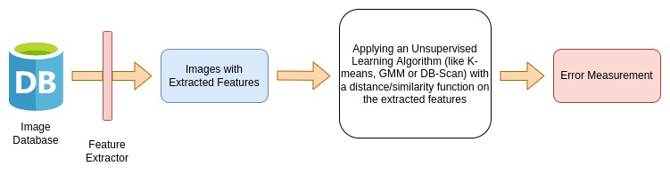

## Introduction and Background

Our project revolves around identifying the breeds of dogs in images. There will be two aspects to the project: classifying dog breeds with an input image using a neural network, and using unsupervised learning algorithms to cluster dogs based on image features. The former project already can be done well provided there is sufficient training data, but a main goal of ours is to create a unique algorithm in the latter part that is comparable to the supervised learning algorithm. Our dataset contains images of multiple dog breeds, along with their corresponding breed and if they were originally used as training data, testing data, or validation data.
## Problem Definition

The purpose of this project is to investigate the effectiveness of methods we are learning in class with classifying dog breeds. In particular, we wish to compare standard supervised methods in their accuracy and efficiency to unsupervised methods relying on feature creation using the input images.

## Datasets
1. [70 Dog Breeds Image dataset from Kaggle](https://www.kaggle.com/gpiosenka/70-dog-breedsimage-data-set)
2. [Stanford Dogs Dataset](http://vision.stanford.edu/aditya86/ImageNetDogs/)

## Methods

### Supervised Learning
We are planning to construct a convolutional neural network to classify dogs into different breeds[1]. Since we are working with multiple datasets, we will have to homogenize them by using OpenCV to bring all the images to the same dimensions. We will experiment with different numbers of layers for the neural network, different epoch sizes, and with splitting data into different percentages for testing and training. Depending on whether the accuracy and F1 score of the model is adequately high, we will experiment with data augmentation (such as reflections and different degrees of rotation). Then, we will be using transfer learning with pre-trained models (such as VGG, GoogLeNet, and Residual Network) to improve our results even further and compare results.

### Unsupervised Learning
Our objective is to create an unsupervised algorithm to cluster images of different breeds of dogs with either a binary assignment (in a particular class or not), or with at least a specific probability[2][3][4][5]. With this goal in mind, we are thinking of exploring a unique unsupervised way that can help us cluster similar dog breeds together. We will be evaluating the performance by measuring the error in clustering a certain breed of dog with a group that consists of dogs from another breed.
The following is our proposed plan for applying unsupervised learning -

At this moment, the key things for us to decide are the Feature Extraction algorithm and the Distance/Similarity function that will be used in the unsupervised algorithm. We plan to experiment with multiple unsupervised algorithms to settle upon the algorithm which gives us the highest accuracy. The project will revolve around these key decisions and choosing parameters.

## Potential Results
A supervised (like neural networks) and unsupervised (like K-means, GMM or DB-Scan) model that can detect a breed given an image of a dog. We will evaluate and compare the performance of both results.

## Discussion
There have been many supervised models which perform animal species classification including dog breed classification. But can we use an unsupervised algorithm to cluster similar dog breeds? The goal of this project is not only constrained to develop a well-performing supervised model but we also plan to apply an unsupervised model that performs comparatively equal to or higher than the classification model. We plan to start with detecting dog breeds and then extend the scope of our project to other image classification problems.

## Proposal Video



## Timeline
[Project Timeline Gantt Chart](https://gtvault-my.sharepoint.com/:x:/g/personal/asharma756_gatech_edu/EWeFmqKgCDpAuTOJQFyzZCABwqLe4j8Rri51ZMPjlnRcjA?e=6M20xI)

## References
[1] K. Lai, X. Tu and S. Yanushkevich, "Dog Identification using Soft Biometrics and Neural Networks," 2019 International Joint Conference on Neural Networks (IJCNN), 2019, pp. 1-8, doi: 10.1109/IJCNN.2019.8851971.

[2] W. Gansbeke, S. Vandenhende, S. Georgoulis, M. Proesmans, and L. Gool, "Scan: Learning to classify images without labels," ECCV, 2020, [Paper link](https://arxiv.org/pdf/2005.12320v2.pdf)

[3] N. Manohar, Y. H. Sharath Kumar and G. H. Kumar, "Supervised and unsupervised learning in animal classification," 2016 International Conference on Advances in Computing, Communications and Informatics (ICACCI), 2016, pp. 156-161, doi: 10.1109/ICACCI.2016.7732040.

[4] Hsu, Alexander. “Unsupervised Learning for Investigating Animal Behaviors?” Medium, Medium, 15 Apr. 2020, https://medium.com/@ahsu2/unsupervised-learning-for-investigating-animal-behaviors-90ab645e8098. 

[5] Huang, Jiabo, Qi Dong, Shaogang Gong, and Xiatian Zhu. "Unsupervised deep learning by neighbourhood discovery." In International Conference on Machine Learning, pp. 2849-2858. PMLR, 2019., [Paper link](https://arxiv.org/abs/1904.11567)
